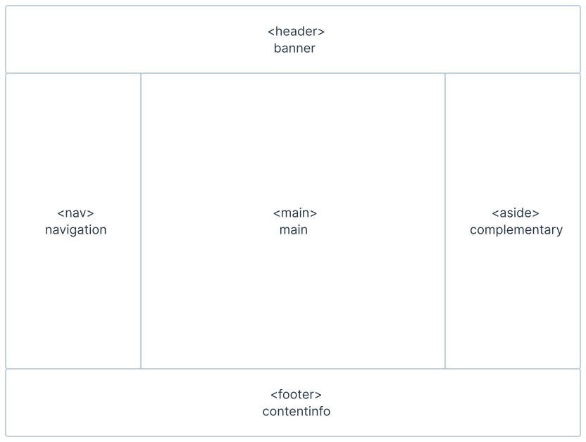

# Regiões de uma Página Web

## O que são Landmarks?

Os landmarks são regiões de uma página web. Eles ajudam os usuários a entenderem a estrutura e a organização de uma página web. Os landmarks permitem aos usuários saltar de uma região para outra usando tecnologia assistiva evitando ter de percorrer a página de forma linear.

<figure><figcaption>
&#x3C;HTML> e Landmarks
</figcaption></figure>
