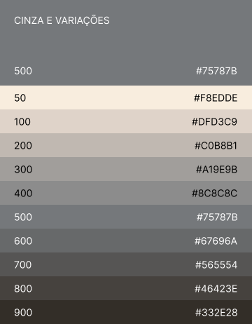

# Cores

A paleta de cores é um elemento fundamental da identidade visual de nossa marca. Ela não só define a estética dos nossos produtos digitais, mas também influencia a percepção e as emoções do usuário. É crucial que as cores sejam aplicadas de maneira consistente para manter a coerência em todos os pontos de contato com o usuário.

## Cores Principais da Marca

São as cores presentes no símbolo e no logotipo da marca Petrobras e suas versões. Por isso, nos identificam facilmente e devem estar presente na comunicação da companhia. É benéfico ter variantes claras e escuras das cores primárias para compor o tema de cores de uma aplicação. As variantes apresentadas foram geradas utilizando o plugin Material Pallet do Figma fixando a cor da marca na tonalidade "500".

<figure><figcaption>
Cores Principais e Variações Geradas pelo Plugin Material Pallete no Figma
</figcaption></figure>

## Cores de Apoio da Marca

As cores de apoio, combinadas com cores principais, oferecem flexibilidade ao sistema de identidade para a criação de diversos materiais.

<figure><figcaption>
Cores de Apoio e Variações Geradas pelo Plugin Material Pallete no Figma
</figcaption></figure>

## Cor Cinza da Marca

A cor cinza é uma cor de apoio e é amplamente usada nas interfaces de produtos digitais.

<figure><figcaption>
Cor Cinza e Variações Geradas pelo Plugin Material Pallete no Figma
</figcaption></figure>

## Branco

De acordo com o Manual do Sistema de Identidade Visual Petrobras: _"A cor branca representa equilíbrio e transmite clareza. Ela é fundamental para o sistema de identidade visual e é, preferencialmente, a base de todos os nossos materiais."_

## Cores Restritas

O **preto** e o **vermelho** não são cores da paleta Petrobras e só podem ser utilizadas de acordo com as seguintes orientações presentes no Manual do Sistema de Identidade Visual Petrobras:

* A cor preta só pode ser utilizada em textos, pictogramas e na versão da marca em preto, quando for impossível o uso de outras versões da marca. Nunca a utilize como cor de fundo ou predominante no layout.
* A cor vermelha só pode ser utilizada em pictogramas e ilustrações que façam sentido com a cor (doação de sangue, por exemplo) e para proibições. Nunca a utilize como cor de fundo ou predominante no layout.
