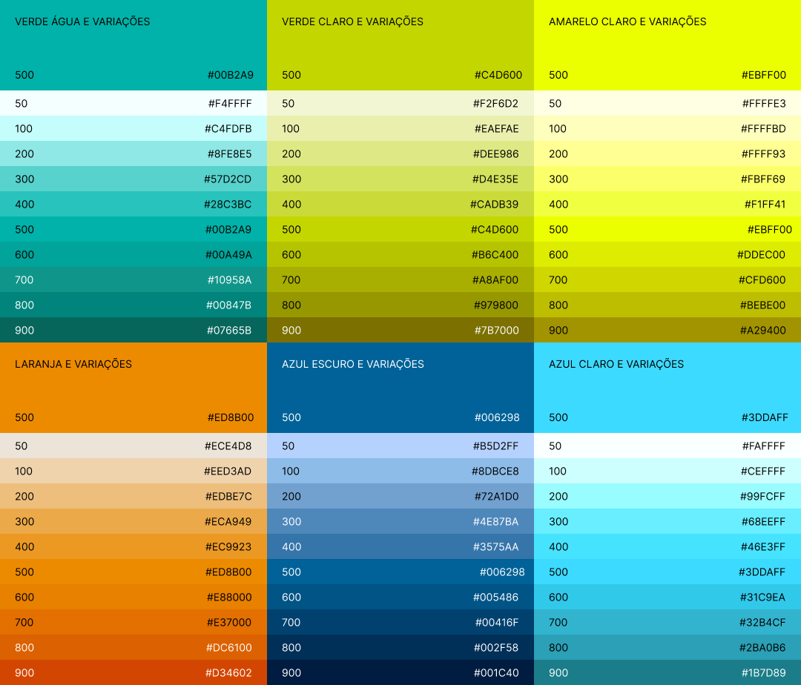

# Cores

A paleta de cores é um elemento fundamental da identidade visual de nossa marca. Ela não só define a estética dos nossos produtos digitais, mas também influencia a percepção e as emoções do usuário. É crucial que as cores sejam aplicadas de maneira consistente para manter a coerência em todos os pontos de contato com o usuário.

## Cores Principais da Marca

São as cores presentes no símbolo e no logotipo da marca Petrobras e suas versões. Por isso, nos identificam facilmente e devem estar presente na comunicação da companhia.



### Variantes Claras e Escuras das Cores Principais

É benéfico ter variantes claras e escuras das cores primárias para compor o tema de cores de uma aplicação. As variantes apresentadas foram geradas utilizando o plugin Material Pallet do Figma fixando a cor da marca na tonalidade "500".

<figure><figcaption>
Cores Principais e Variações Geradas pelo Plugin Material Pallete no Figma
</figcaption></figure>

## Cores de Apoio da Marca

As cores de apoio, combinadas com cores principais, oferecem flexibilidade ao sistema de identidade para a criação de diversos materiais.



### Variantes Claras e Escuras das Cores de Apoio

<figure><figcaption></figcaption></figure>
