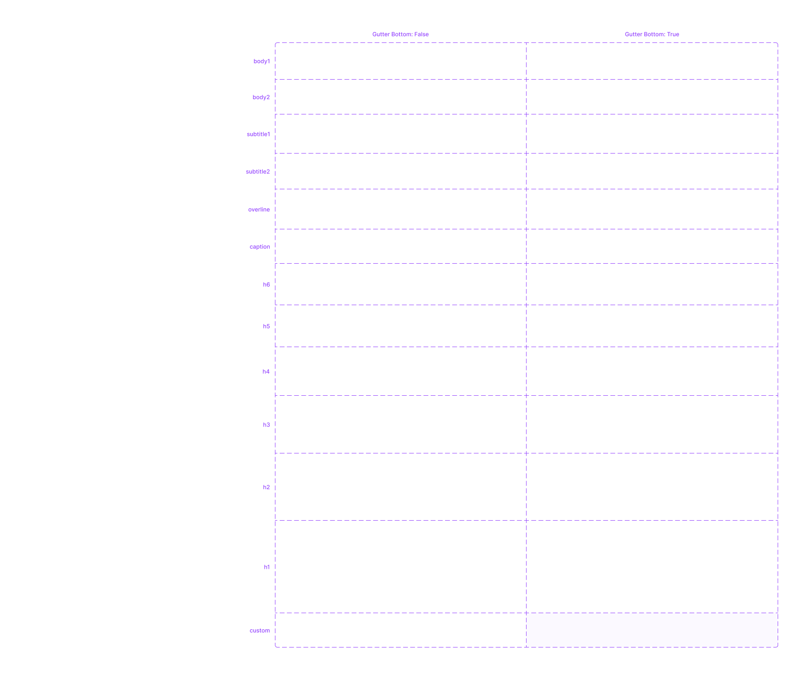

# O que você precisa saber sobre Nafto UI Kit para React?

##

##

##

## Introdução

O Nafto UI Kit para React é um arquivo do Figma usado por designers no desenvolvimento de aplicações React. Ele é baseado no Material UI for Figma.

<figure><figcaption>
O Nafto UI Kit para React é utilizado pelos designers e é baseado no MUI for Figma
</figcaption></figure>

As customizações realizadas no MUI for Figma incluem:

* Cores.
* Tipografia.
* Criação de:
  * Componentes exclusivos.
  * Modelos de tela.

## Cores

Uma nova coleção foi criada sob o nome "nafto/cores", onde estão definidas as [cores da marca Petrobras](../../../../guia-de-identidade-visual/cores.md).

<figure><figcaption>
Coleção "nafto/cores" no arquivo do Figma Nafto UI Kit para React
</figcaption></figure>

Outra alteração realizada foi na coleção "palette", onde as cores dos grupos "primary", "primary/states", "secondary" e "secondary/\_states" foram modificadas para refletirem as [cores da Marca Petrobras](../../../../guia-de-identidade-visual/cores.md).

<figure><figcaption>
Coleção "palette" no arquivo do Figma Nafto UI Kit para React
</figcaption></figure>

## Tipografia

Os estilos de texto foram alterados da fonte Roboto para **Petrobras Sans**. Esses estilos abrangem títulos (**h1..h6**), corpo de texto (**body1 e body2**), subtítulos (**subtitle1 e subtitle2**), linha superior (**overline**) e legenda (**caption**), além de estilos específicos para componentes como botões, DataPickers, menus e tabelas.

<figure><figcaption>
Estilos de texto com a fonte Petrobras Sans no no arquivo do Figma Nafto UI Kit para React
</figcaption></figure>

### Estilos de Texto e HTML Semântico 

No Figma, os estilos de texto de h1 a h6 ajudam os designers a criar uma hierarquia visual, mas eles não seguem automaticamente a hierarquia semântica do HTML. Por exemplo, um designer pode usar h1 para destacar o nome de um site, enquanto no HTML, h1 deve representar o título principal da página. Essa prática pode confundir tanto os desenvolvedores quanto as tecnologias assistivas, prejudicando a acessibilidade. Para resolver isso, os designers devem anotar no Figma quando um estilo visual deve corresponder a um diferente nível de cabeçalho no HTML, assegurando que a intenção visual alinhe-se com a semântica correta.

### Mapeamento de Estilos de Texto para HTML5 

| Figma     | HTML   |
| --------- | ------ |
| h1        | `<h1>` |
| h2        | `<h2>` |
| h3        | `<h3>` |
| h4        | `<h4>` |
| h5        | `<h5>` |
| h6        | `<h6>` |
| subtitle1 | `<h6>` |
| subtitle2 | `<h6>` |
| body1     | `
`  |
| body2     | `
`  |

## Para Saber Mais 

* [A escala tipográfica no Material Design 2](https://m2.material.io/design/typography/the-type-system.html#type-scale)
* [O componente Typography no Material UI](https://mui.com/material-ui/react-typography/)
* [Tutorial do W3C sobre Headings](https://www.w3.org/WAI/tutorials/page-structure/headings/)

