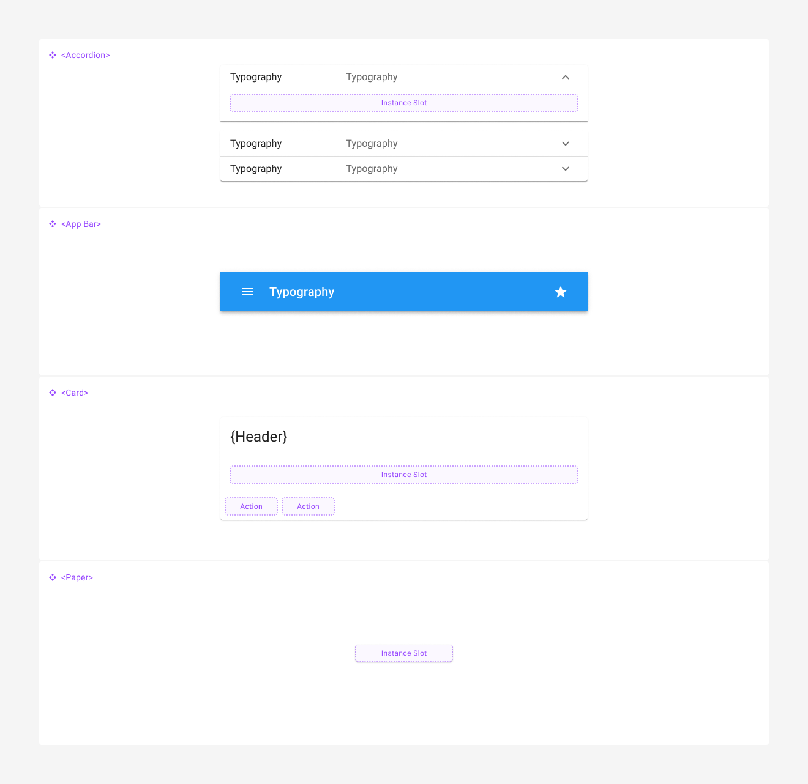
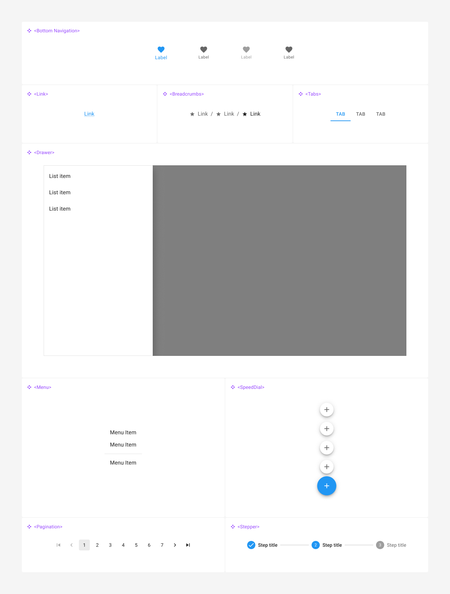

# React

React é uma biblioteca JavaScript desenvolvida pelo Facebook (hoje Meta) para a criação de interfaces de usuário dinâmicas e modernas. Ela se baseia no conceito de composição de componentes, facilitando o desenvolvimento de UIs complexas, dinâmicas e reutilizáveis.

## Material UI (MUI)

Construída sobre a fundação do React, a biblioteca MUI oferece uma gama extensa de componentes de UI prontos para uso, que facilitam o desenvolvimento de interfaces ricas e consistentes. É a biblioteca recomenda para o desenvolvimento de aplicações React. O MUI é baseado nas especificações do Material Design do Google.

<figure><figcaption>
Relacionamento entre Material UI e Material Design
</figcaption></figure>

## Produtos Oferecidos pela MUI 

A MUI oferece três principais produtos para atender diferentes necessidades de desenvolvimento.

### **MUI Core** 

É a biblioteca principal. É gratuita e inclui todos os componentes básicos do Material UI. É ideal para a maioria dos projetos que precisam de uma interface de usuário moderna e consistente.

### **MUI X** 

Esta é uma extensão do MUI Core, oferecendo componentes avançados e complexos, como data grids, date pickers e outros elementos que demandam mais funcionalidade e customização. É voltado para aplicações mais sofisticadas que necessitam de recursos adicionais. Não é gratuita.

### **MUI for Figma** 

Este produto é destinado a designers que utilizam o Figma. Ele fornece uma biblioteca completa de componentes Material UI que podem ser utilizados diretamente no Figma para criar protótipos e designs de alta fidelidade, garantindo que o design e o desenvolvimento estejam perfeitamente alinhados. Existe uma versão gratuita (Community Edition) e uma versão paga. A versão gratuita contém apenas as instâncias dos componentes do Material UI, não os componentes de origem. Serve para montar telas rapidamente, mas para personalizações como tipografia, cores ou modo escuro, é necessária a versão paga.

## Componentes do Material UI 

Material UI oferece uma extensa variedade de componentes que ajudam a construir aplicações web completas e consistentes. Aqui estão algumas das principais categorias de componentes disponíveis.

### **Componentes de Entrada de Dados (Inputs)** 

Campos de texto, checkboxes, radio buttons, selects, sliders e outros elementos para coleta de dados dos usuários.

<figure><figcaption>
Visão Geral dos Componentes de Entrada de Dados (Inputs). Imagem obtida no <a href="https://www.figma.com/community/file/912837788133317724">Material UI Community Edition</a>.
</figcaption></figure>

### **Componentes de Exibição de Dados (Data Display)** 

Tabelas, listas, avatares, badges, tooltips e outros componentes para exibir informações de maneira clara e acessível.

<figure><figcaption>
Visão Geral dos Componentes de Exibição de Dados (Data Display). Imagem obtida no <a href="https://www.figma.com/community/file/912837788133317724">Material UI Community Edition</a>.
</figcaption></figure>

### **Componentes de Feedback** 

Diálogos, snackbars, progress indicators e outros componentes para fornecer feedback ao usuário.

<figure><figcaption>
Visão Geral dos Componentes de Feedback. Imagem obtida no <a href="https://www.figma.com/community/file/912837788133317724">Material UI Community Edition</a>.
</figcaption></figure>

### **Componentes de Superfície (Surface)** 

Cards, accordions, paper e outros elementos para criar seções distintas e destacar conteúdo.

<figure><figcaption>
Visão Geral dos Componentes de Superfície (Surface). Imagem obtida no <a href="https://www.figma.com/community/file/912837788133317724">Material UI Community Edition</a>.
</figcaption></figure>

### **Componentes de Navegação (Navigation)** 

Menus, abas, breadcrumbs, pagination e outros componentes para facilitar a navegação do usuário.

<figure><figcaption>
Visão Geral dos Componentes de Navegação (Navigation). Imagem obtida no <a href="https://www.figma.com/community/file/912837788133317724">Material UI Community Edition</a>.
</figcaption></figure>

### **Componentes de Layout** 

Grid system, boxes, containers e outros elementos para estruturar a página de forma responsiva e organizada.

<figure><figcaption>
Visão Geral dos Componentes de Layout. Imagem obtida no <a href="https://www.figma.com/community/file/912837788133317724">Material UI Community Edition</a>
</figcaption></figure>

## &#x20;

## Para Saber Mais 

* [MUI](https://mui.com/)
* [Material Design](https://m3.material.io/)

* Arquivo do Nafto UI Kit para React.
* Arquivo de configuração do tema para aplicações React (JSON).
* Referência aos componentes React do MUI.
* Referência à arquitetura de referência da TIC.
