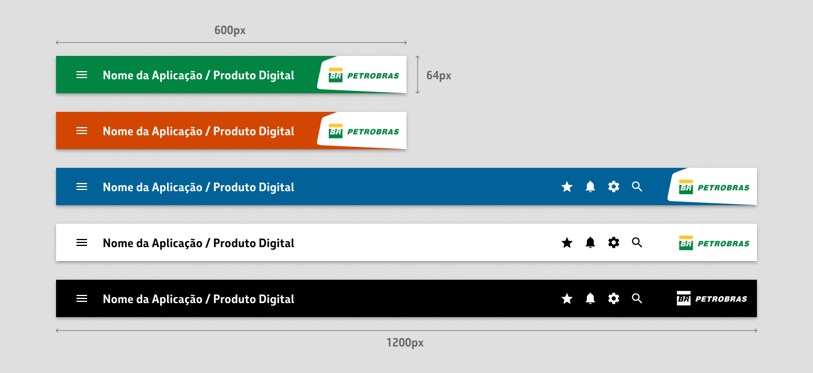
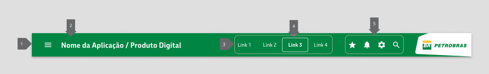

# Como projetar interfaces usando o Nafto UI Kit para React?

## Use um header padronizado

Foi desenvolvido um header padronizado para refletir a identidade visual da Cia e garantir que ele seja funcional e acessível.

### **Estrutura do header no Figma**

O componente `AppBar` serve como o principal ponto de navegação global, agrupando ícones e links essenciais. A seguir, detalhamos a anatomia deste header padronizado, destacando seus principais componentes e como utilizá-los corretamente.

<figure><figcaption></figcaption></figure>

* **App Bar**: O elemento base do header. Ele funciona como um contêiner principal que organiza os elementos de navegação e exibição. Em muitos casos, é usado em conjunto com o **Paper** para criar um efeito de elevação, dando destaque à barra de navegação.
* **Paper**: O uso do componente **Paper** na **App Bar** ajuda a criar uma separação visual entre a barra de navegação e o restante da interface. A elevação aplicada pelo **Paper** cria uma sensação de profundidade, essencial para destacar o header.
* **Toolbar**: Dentro da **App Bar**, a **Toolbar** organiza e distribui os elementos com espaçamento automático, garantindo um layout equilibrado. Ela estrutura os componentes tanto no lado esquerdo quanto no lado direito, mantendo a coerência visual e funcionalidade.
  * **Lado Esquerdo** (**Left Side**): Os componentes à esquerda geralmente contêm elementos que ajudam na navegação e identificação da aplicação.
    * **IconButton (Menu Hamburguer)**: Este botão serve para ativar a navegação lateral (drawer), especialmente útil em layouts responsivos, permitindo ao usuário acessar o menu principal.
    * **Typography (Título da Aplicação)**: O nome ou título da aplicação é exibido de maneira clara, facilitando a identificação do sistema em uso.
  * **Lado Direito** (**Stack com Links e Ícones Globais**): No lado direito do header, os elementos são organizados em um **Stack** que alinha os principais itens globais.
    * **Links**: São os links de navegação global que levam o usuário às principais seções da aplicação.
    * **Search**: O componente **Search** permite que os usuários façam buscas dentro da aplicação. Normalmente, é composto por um campo de entrada de texto com um ícone de lupa que facilita a busca de informações de forma rápida e intuitiva.
    * **ListItem**: O **ListItem** é um componente que organiza itens individuais dentro de uma lista, como em menus ou dropdowns. Ele é usado para representar opções selecionáveis, como links de navegação, facilitando a interação do usuário com os itens da interface.
    * **Ícones**: Incluem ícones como notificações, perfil do usuário e configurações, proporcionando acesso rápido a funcionalidades importantes.
    * **Marca (Logomarca da Empresa)**: A logomarca da empresa deve estar presente de forma destacada, reforçando a identidade visual e a presença da marca.

### Header Desktop

<figure><figcaption></figcaption></figure>

### Header Tablet

<figure><figcaption></figcaption></figure>

### Header Celular

<figure><figcaption></figcaption></figure>

### Acessibilidade no header

<figure><figcaption></figcaption></figure>

1. **Landmark do header**: `<header>`\
   O elemento `<header>` já possui, por padrão, o papel de landmark com o `role="banner"`, portanto, não é necessário adicionar esse atributo manualmente. Ele indica que esta é a seção principal do cabeçalho da página.
2. **Título (Typography)**: `<h6>`\
   O título da aplicação deve ser marcado com um elemento `<h6>`, respeitando a hierarquia semântica da página. Além disso, o título deve atender aos critérios de **contraste mínimo AA**, garantindo que a cor do texto tenha contraste suficiente com o fundo do header (geralmente estilizado com **Paper**), para garantir acessibilidade visual adequada.
3. **Label descrevendo navegação principal**:\
   `<nav aria-label="links principais">`\
   O elemento `<nav>` já exerce o papel de **landmark** (`navigation`), indicando que ele contém a navegação principal da página. Adicionar um atributo `aria-label` descrevendo sua função (neste caso, "links principais") melhora a acessibilidade para tecnologias assistivas, permitindo que os usuários entendam que se trata da navegação principal.
4. **Lista de links e indicação do link selecionado**:\
   A lista de links de navegação deve ser estruturada com o elemento `<ul>`. O link selecionado na navegação deve conter o atributo `aria-current="page"`.

```html
<ul>
  <li><a href="..." aria-current="page">Link 3</a></li>
</ul>
```

5. **Label descrevendo navegação por ícones**:\
   `<nav aria-label="ícones globais">`\
   A navegação através de ícones globais (como notificações ou perfil de usuário) deve ser envolvida por um `<nav>` com o atributo `aria-label="ícones globais"` para proporcionar acessibilidade adequada.

## Como projetar um footer?

## Como projetar um modal pop-up?

## Como projetar um card?

## Como projetar uma tabela de dados?

## Como projetar um formulário?

## Como projetar a tela principal de uma aplicação?
