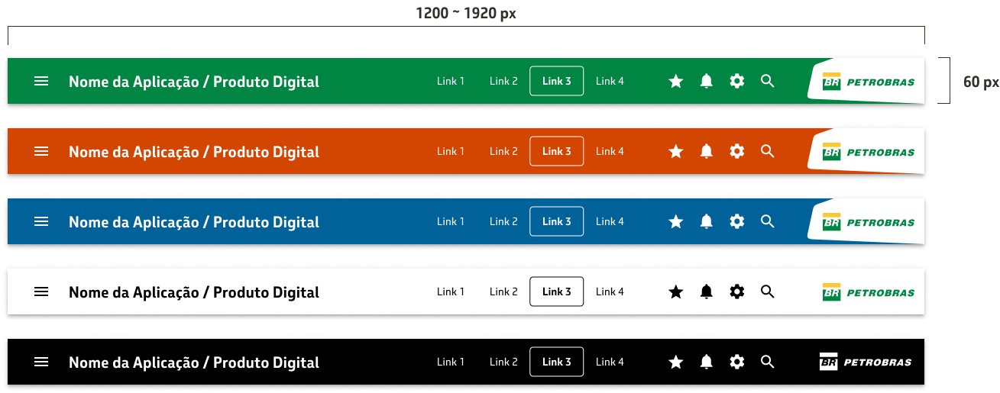

# Como projetar interfaces usando o Nafto UI Kit para React?

Ao projetar um **header** (também conhecido como **App Bar**) para uma aplicação, é importante garantir que ele seja funcional, acessível e reflita a identidade visual da empresa. A **App Bar** serve como o principal ponto de navegação global e agrupamento de ícones e links essenciais. A seguir, detalhamos a anatomia do header que foi projetado.

## **Estrutura do Header**

* **App Bar**: O elemento base do header. Ele funciona como um contêiner principal que organiza os elementos de navegação e exibição. Em muitos casos, é usado em conjunto com o **Paper** para criar um efeito de elevação, dando destaque à barra de navegação.
* **Paper**: O uso do componente **Paper** na **App Bar** ajuda a criar uma separação visual entre a barra de navegação e o restante da interface. A elevação aplicada pelo **Paper** cria uma sensação de profundidade, essencial para destacar o header.
* **Toolbar**: Dentro da **App Bar**, a **Toolbar** organiza e distribui os elementos com espaçamento automático, garantindo um layout equilibrado. Ela estrutura os componentes tanto no lado esquerdo quanto no lado direito, mantendo a coerência visual e funcionalidade.
  * **Lado Esquerdo** (**Left Side**): Os componentes à esquerda geralmente contêm elementos que ajudam na navegação e identificação da aplicação.
    * **IconButton (Menu Hamburguer)**: Este botão serve para ativar a navegação lateral (drawer), especialmente útil em layouts responsivos, permitindo ao usuário acessar o menu principal.
    * **Typography (Título da Aplicação)**: O nome ou título da aplicação é exibido de maneira clara, facilitando a identificação do sistema em uso.
  * **Lado Direito** (**Stack com Links e Ícones Globais**): No lado direito do header, os elementos são organizados em um **Stack** que alinha os principais itens globais.
    * **Links**: São os links de navegação global que levam o usuário às principais seções da aplicação.
    * **Ícones Globais**: Incluem ícones como notificações, perfil do usuário e configurações, proporcionando acesso rápido a funcionalidades importantes.
    * **Marca (Logomarca da Empresa)**: A logomarca da empresa deve estar presente de forma destacada, reforçando a identidade visual e a presença da marca.

## Exemplos de Header

<figure><figcaption></figcaption></figure>

## Header com Notas de Acessibilidade

<figure><figcaption></figcaption></figure>

1. Landmarks:

```
<header role=”banner”>
```

2. Título: H6
3. Label descrevendo navegação principal

```
<nav aria-label=”links principais”>
```

4. Lista e atributo indicando link selecionado

```
<ul><li><a href=”...” aria-current=”page”>Link 3</ul>
```

5. Label descrevendo navegção por ícone:

```
<nav aria-label=”ícones globais”>
```


## Como projetar um footer?

## Como projetar um modal pop-up?

## Como projetar um card?

## Como projetar uma tabela de dados?

## Como projetar um formulário?

## Como projetar a tela principal de uma aplicação?
