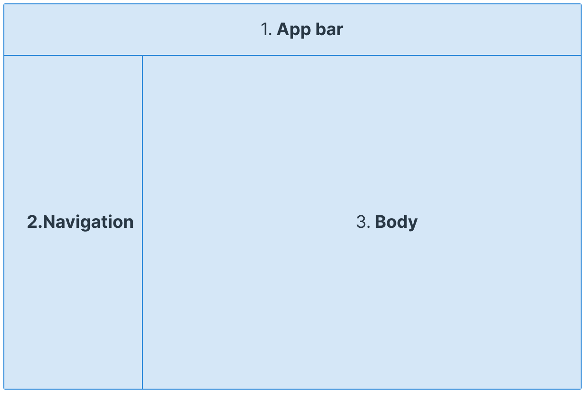

# Use um Layout Padronizado

#### Anatomia de um Layout

A anatomia de um layout define as bases para experiências interativas, composta por regiões que agrupam elementos e componentes com funções semelhantes. Essas regiões são os blocos estruturais de um layout e podem conter outros contêineres menores, como cartões.

Em uma tela grande, um layout típico possui três regiões principais:

1. **App Bar**: Barras de navegação e ações localizadas no topo da página. Corresponde ao **header padronizado**  que foi desenvolvido, incorporando a identidade visual da empresa.
2. **Navegação**: A região de navegação é composta por componentes e elementos que ajudam os usuários a navegar entre destinos em um aplicativo e acionar ações importantes.
3. **Corpo**: O espaço principal que exibe o conteúdo central.

<figure><figcaption></figcaption></figure>

Ao criar um sistema de layout responsivo, é importante definir dimensões mínimas e máximas para o corpo e margens, além de comportamentos de escala que adaptem essas regiões a diferentes formatos de tela. Essa abordagem garante uma experiência consistente em dispositivos variados.

A região de navegação mantém uma largura consistente de 256 px quando expandida e de 72 px quando recolhida.

## Navegação para Celular: 320 - 600px

Em telas menores, com largura abaixo de 600 px, um drawer de navegação modal pode preencher a região de navegação, aparecendo elevado acima da região do corpo.

<figure><figcaption>
Navegação para telas menores que 600px.
</figcaption></figure>

## Navegação para Tablet: 600 - 1200px

### Aberta

<figure><figcaption></figcaption></figure>

### Fechada

<figure><figcaption></figcaption></figure>

## Navegação para Desktop:  1200 - 1920+ px

##

## Corpo da Página

